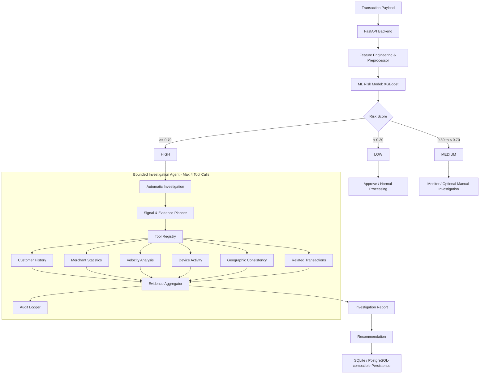

AI Payment Risk Investigator
A full-stack AI/ML prototype for payment risk scoring, evidence gathering, and bounded agent investigation. Built for the Razorpay AI Builder / AI Risk Manager challenge.
---
1. Problem Statement
Payment platforms need to evaluate large volumes of transaction attempts while balancing fraud detection, customer friction, latency, and investigation cost.
Traditional static rule engines can become difficult to maintain and may generate unnecessary false positives. Using an LLM alone for raw transaction scoring can also introduce additional latency, cost, and reliability concerns.
This project explores a hybrid approach that combines fast deterministic ML scoring with auditable evidence gathering and a bounded investigation agent.
---
2. Solution
The AI Payment Risk Investigator uses a hybrid defensive architecture:
Machine Learning Risk Engine  
A deterministic ML pipeline estimates transaction risk probability and classifies transactions as `LOW`, `MEDIUM`, or `HIGH`.
Deterministic Evidence Tools  
Python-based tools gather supporting evidence such as customer history, merchant statistics, transaction velocity, device activity, geographic consistency, and related transactions.
Bounded Investigation Agent  
HIGH-risk transactions automatically enter an investigation workflow. The agent uses a planner and tool registry to select relevant evidence sources, with a strict maximum of `MAX_TOOL_CALLS = 4`.
Optional LLM Enhancement  
When configured, an LLM can enhance investigation narratives. The application remains functional without an LLM through deterministic fallbacks.
Auditability  
Investigation steps, tool execution, evidence status, and recommendations are recorded for review.
---
3. Why This Approach
The system separates fast risk scoring from deeper investigation:
ML provides a fast initial risk estimate.
Deterministic tools provide auditable evidence.
The agent selects relevant evidence instead of blindly calling every tool.
The four-tool limit controls investigation cost and latency.
Executed investigation steps are recorded in an audit trail.
The system remains functional without an LLM through deterministic fallbacks.
Synthetic data keeps the project safe for educational and demonstration use.
---
4. Key Features
Synthetic Data Pipeline: 25,000 synthetic transactions with engineered risk-related interactions and noise.
Explainable Risk Signals: Signals such as amount deviation, geographic mismatch, velocity spikes, device novelty, recent failures, IP risk, and unusual transaction time.
Dynamic Bounded Agent: Planner-driven tool selection with `MAX_TOOL_CALLS = 4`, early stopping, evidence aggregation, and audit steps.
Evidence State Tracking: Clearly distinguishes `VERIFIED`, `NOT CHECKED`, and `NOT AVAILABLE`.
Full-Stack Dashboard: React + Vite interface for transaction analysis, risk scoring, preset demonstrations, analytics, investigation results, and audit trails.
REST API: FastAPI backend for health checks, transaction analysis, investigations, audit logs, and analytics.
Automated Testing: 19/19 pytest tests passing across ML, API, investigation, agent, evidence, and validation workflows.
Containerization: Docker and Docker Compose configuration included.
---
5. Architecture

Investigation Flow
```text
Transaction
    |
    v
ML Risk Score
    |
    +---- LOW ------> Normal Processing
    |
    +---- MEDIUM ---> Monitor / Optional Manual Investigation
    |
    +---- HIGH -----> Bounded Investigation Agent
                          |
                          +--> Select relevant tools
                          |
                          +--> Execute up to 4 tools
                          |
                          +--> Aggregate evidence
                          |
                          +--> Generate report
                          |
                          +--> Record audit steps
```
---
6. Risk Classification
The application uses the following risk thresholds:
Risk Probability	Classification
`< 0.30`	LOW
`>= 0.30 and < 0.70`	MEDIUM
`>= 0.70`	HIGH
The threshold boundaries are explicitly covered by automated tests, including values immediately below, at, and above `0.30` and `0.70`.
Investigation Behavior
LOW: No automatic investigation.
MEDIUM: Optional/manual investigation is available when additional evidence is required.
HIGH: Automatically enters the bounded investigation workflow.
---
7. Evidence States
Investigation evidence is deliberately represented using three states:
VERIFIED — the tool executed successfully and returned usable evidence.
NOT CHECKED — the tool was not executed, for example because the four-tool investigation budget was reached.
NOT AVAILABLE — the tool executed but returned no usable evidence.
The application does not convert missing or unexecuted tool results into misleading binary values.
---
8. Evaluation Results
The models were evaluated on a held-out test set of 5,000 synthetic transactions from the 25,000-transaction dataset.
Metric	Logistic Regression	Random Forest	XGBoost (Serving Model)
Accuracy	87.86%	87.84%	87.64%
Precision	68.95%	68.37%	68.12%
Recall	46.76%	47.61%	45.78%
F1 Score	0.5573	0.5613	0.5476
ROC-AUC	0.7435	0.7439	0.7535
False Positive Rate	4.11%	4.30%	4.18%
False Negative Rate	53.24%	52.39%	54.22%
Estimated FP Business Cost ($50/unit)	$8,600	$9,000	$8,750
Serving Model
XGBoost is used as the serving model because it achieved the highest ROC-AUC among the evaluated models (`0.7535`) while maintaining competitive precision and a 4.18% false-positive rate.
Confusion Matrix — XGBoost
	Actual Negative	Actual Positive
Predicted Negative	4,008	443
Predicted Positive	175	374
The evaluation uses a fixed estimated false-positive cost of $50 per false positive to make the business trade-off explicit.
---
9. Demo Flow
Submit a transaction through the dashboard.
FastAPI validates the transaction payload.
Feature engineering prepares the model input.
XGBoost estimates the risk probability.
The system classifies the transaction as LOW, MEDIUM, or HIGH.
HIGH-risk transactions automatically enter the investigation workflow.
The bounded planner selects relevant evidence tools.
A maximum of four tools are executed.
Evidence is aggregated into a structured investigation report.
The system produces a recommendation.
Investigation steps are recorded in the audit trail.
---
10. Technology Stack
Backend
Python 3.11+
FastAPI
Pydantic
SQLAlchemy
Uvicorn
Machine Learning
pandas
NumPy
scikit-learn
joblib
XGBoost
Agent
Custom lightweight tool-calling orchestrator
Planner
Tool Registry
Bounded Execution Loop
Evidence Aggregator
Deterministic fallback
Optional LLM narrative enhancement
Frontend
React
Vite
Tailwind CSS
Database
SQLite by default
PostgreSQL-compatible persistence design
Testing
pytest
FastAPI TestClient
Deployment
Docker
Docker Compose
---
11. Project Structure
```text
ai-payment-risk-investigator/
├── agent/                 # Investigation planner, tools, schemas, orchestration
├── backend/               # FastAPI application and API routes
├── data/                  # Synthetic transaction data
├── docs/                  # Architecture and supporting documentation
├── evaluation/            # Evaluation results and metrics
├── frontend/              # React + Vite dashboard
├── ml/                    # Dataset generation, training, prediction and evaluation
│   └── model/             # Persisted trained model artifacts
├── tests/                 # Automated test suite
├── Dockerfile
├── docker-compose.yml
├── pytest.ini
├── requirements.txt
├── .env.example
├── .gitignore
└── README.md
```
---
12. Installation
12.1 Clone the Repository
```bash
git clone https://github.com/ManjunathByadagi/ai-payment-risk-investigator.git
cd ai-payment-risk-investigator
```
12.2 Create a Python Virtual Environment
Windows PowerShell
```powershell
python -m venv venv
.\venv\Scripts\Activate.ps1
```
macOS / Linux
```bash
python -m venv venv
source venv/bin/activate
```
12.3 Install Python Dependencies
```bash
pip install -r requirements.txt
```
---
13. Generate Synthetic Data
If regenerating the dataset from scratch:
```bash
python -m ml.generate_dataset
```
The project is designed around a synthetic dataset of approximately 25,000 transactions.
---
14. Train the Models
```bash
python -m ml.train
```
The training pipeline persists the trained model artifacts under:
```text
ml/model/
```
The current serving model is XGBoost.
---
15. Evaluate the Models
```bash
python -m ml.evaluate
```
Evaluation metrics are written to:
```text
evaluation/results/evaluation_metrics.json
```
The evaluation compares Logistic Regression, Random Forest, and XGBoost using a held-out test set.
---
16. Run Automated Tests
Run the complete test suite:
```bash
python -m pytest -v
```
Current validation:
```text
19 passed
```
The tests cover:
ML risk predictions
Risk threshold boundaries
Transaction validation
API health
Investigation workflow
Dynamic agent tool selection
Four-tool execution limit
Deterministic fallbacks
Evidence mapping
Evidence states
Audit steps
Customer history behavior
---
17. Start the Backend
From the project root:
```bash
uvicorn backend.main:app --reload --port 8000
```
Health endpoint:
```text
http://localhost:8000/health
```
---
18. Start the Frontend
Open another terminal:
```bash
cd frontend
npm install
npm run dev
```
Open the local frontend URL shown by Vite, typically:
```text
http://localhost:3000
```
---
19. Docker Deployment
Build and start the application using Docker Compose:
```bash
docker-compose up --build
```
---
20. API Reference
Method	Endpoint	Purpose
`GET`	`/health`	Backend health check and LLM availability
`POST`	`/api/v1/transactions/analyze`	Score and classify a transaction
`GET`	`/api/v1/transactions/{transaction_id}`	Retrieve transaction scoring details
`POST`	`/api/v1/investigations/{transaction_id}`	Run an investigation when permitted
`GET`	`/api/v1/audit`	Retrieve audit records
`GET`	`/api/v1/analytics/summary`	Retrieve dashboard analytics
---
21. Design Decisions
Why ML instead of only rules?
Rules are useful for deterministic controls, but a machine-learning model can capture non-linear interactions between transaction attributes. This project therefore uses ML for the initial risk estimate and deterministic tools for verification.
Why not use an LLM for raw risk scoring?
The core risk score needs to be deterministic and testable. An LLM is therefore optional and positioned as a narrative enhancement rather than the primary scoring mechanism.
Why limit the agent to four tools?
A bounded investigation loop provides predictable cost and latency while still allowing the agent to gather multiple independent signals. The system records tools that were not called as `NOT CHECKED` rather than pretending that every signal was verified.
Why use synthetic data?
The project is intended for an educational challenge and technical demonstration. Synthetic data avoids exposing real payment or customer information.
---
22. Limitations
This is a student challenge prototype and should not be treated as a production fraud detection system.
Current limitations include:
Evaluation is performed on synthetic rather than real payment data.
Model performance may not generalize to real-world fraud patterns.
The agent is intentionally bounded to four tool calls.
The estimated false-positive cost uses a fixed $50/unit assumption.
No real payment rails or banking systems are connected.
Production-scale latency, load testing, monitoring, and model drift management are outside the scope of this prototype.
---
23. Security & Privacy
No real payment credentials are processed.
The project uses synthetic transaction data.
API keys and secrets should be supplied through environment variables.
`.env` files are excluded from version control.
`.env.example` provides a safe configuration template.
---
24. Testing & Reproducibility
The final development environment used for model training and validation includes:
Python 3.11.7
scikit-learn 1.9.0
XGBoost 3.2.0
The repository includes dependency configuration and trained model artifacts required by the application.
For reproducibility, retraining should be performed in the documented Python environment before comparing new metrics with the reported evaluation results.
---
25. Disclaimer
This project uses synthetic data only and is designed for educational, student challenge, and technical demonstration purposes.
It does not execute real financial payments, connect to banking rails, or make decisions about real customers.
---
26. Challenge Context
This project was developed for the Razorpay AI Builder / AI Risk Manager challenge as a defensive payment-risk investigation system.
The core objective is to demonstrate how machine learning, deterministic evidence tools, and a bounded investigation agent can work together to identify suspicious transactions while keeping investigation behavior explainable, auditable, and cost-conscious.
---
27. Author
Manjunath Byadagi
Project repository:
https://github.com/ManjunathByadagi/ai-payment-risk-investigator