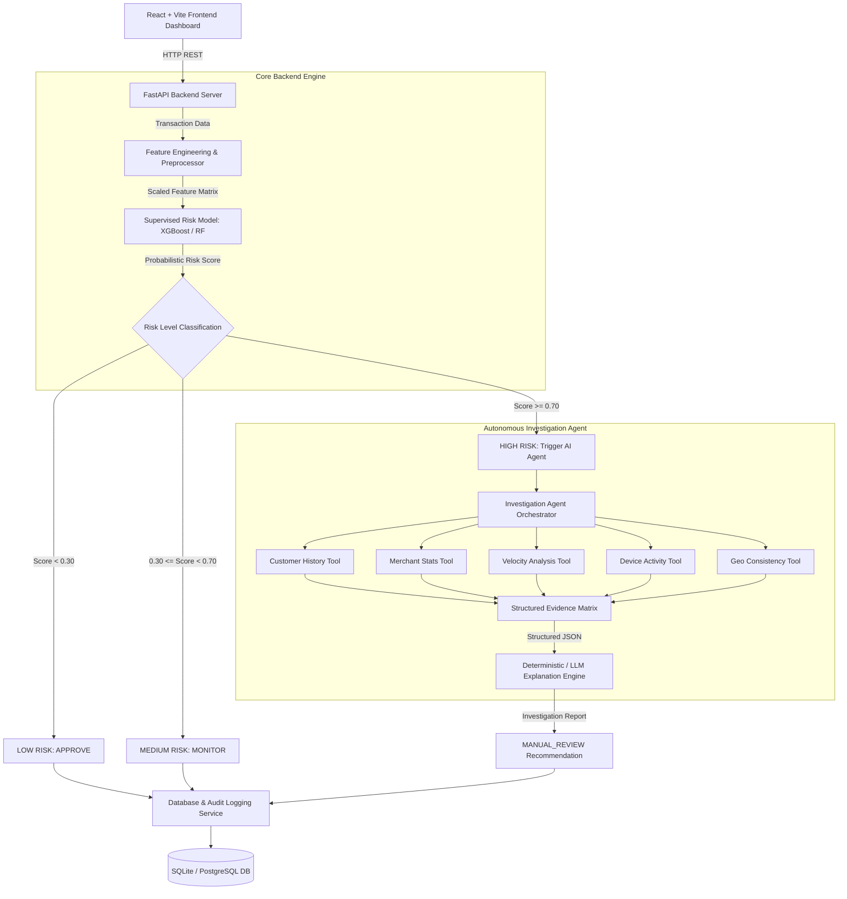

# System Architecture & Technical Specifications

## 1. System Overview
The **AI Payment Risk Investigator** is a defensive, dual-tier payment anomaly risk analysis and investigation platform.
It combines supervised machine learning for fast risk scoring with a tool-calling AI agent for bounded evidence collection and automated synthesis.

## 2. Core Architectural Diagram

## 3. Component Details

### 3.1 Preprocessing & Feature Pipeline
- Input features are scaled using `StandardScaler` fitted strictly on training data to prevent data leakage.
- Derived features (Amount Deviation, Geographic Mismatch Indicator, Velocity Score) are computed dynamically before inference.

### 3.2 Machine Learning Engine
- Primary Serving Model: **XGBoost Classifier** persistence artifact (`ml/model/risk_model.joblib`).
- Baselines: Logistic Regression and Random Forest.
- Outputs continuous risk probability between `0.0` and `1.0`.

### 3.3 Autonomous Investigation Agent
- Triggers when `risk_probability >= 0.70`.
- Bounded Execution: Uses 5 deterministic read-only tools to gather contextual background.
- LLM Fallback: If `OPENAI_API_KEY` is present, OpenAI model formats evidence into narrative reports. If missing or failing, deterministic rules format evidence safely.

### 3.4 Data & Persistence Layer
- ORM: SQLAlchemy models for `Transaction`, `Investigation`, and `AuditLog`.
- Storage: SQLite default (`risk_investigator.db`), PostgreSQL ready via `DATABASE_URL`.
